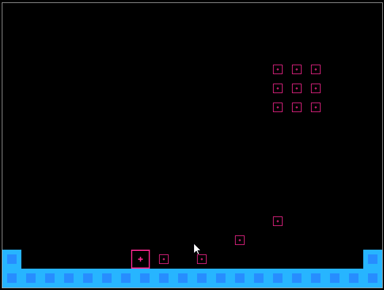

# P01
An old (2016/2017) game project of mine (now paused/aborted). Featuring a simple platformer game play and dynamic level editor.

I'm just putting it here because it was kinda cool :) 

## Try it

| Commands        | Description                               |
|-----------------|-------------------------------------------|
| `npm start`     | Start the development server              |
| `npm run build` | Build the project                         |
| `npm run clean` | Delete the last build and temporary files |

## Controls
- Arrow keys to move and jump
- Escape to enter/exit edit mode
- In editmode:
  - Left click to add a block
  - Right click to delete a block
  - Mouse scroll to choose the block
  - Tab to switch between tilemap mode and object mode

## Made with
* [Phaser Starter](https://github.com/Oli4242/phaser-starter)
* [Phaser CE 2.7.3](https://www.phaser.io) (without ninja, p2, creature)
* [Phaser Behavior Plugin](https://github.com/luizbills/phaser-behavior-plugin)
* [Phaser Inspector](https://github.com/netcell/phaser-inspector)
* ES2016 ([Babel](https://babeljs.io))
* Build System & dev server ([Broccoli](http://broccolijs.com) / [Browserify](http://browserify.org/))
